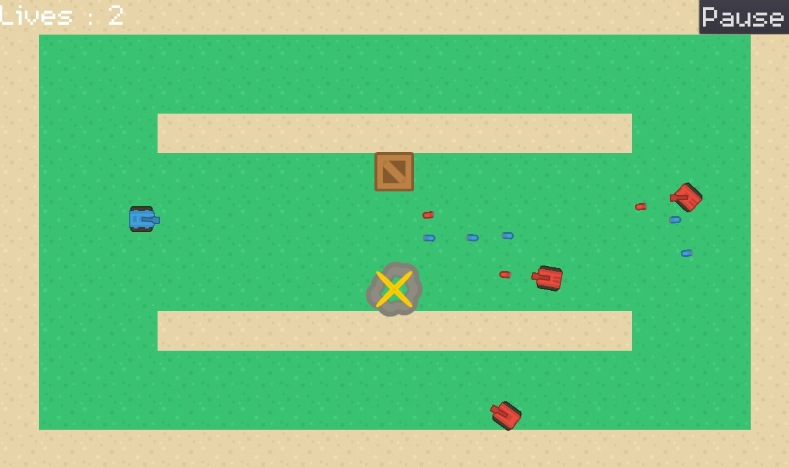

# Tanks

Tank game made in Godot Engine. Can you clear all 10 levels?

WASD to move, left click to shoot. R to restart from Level 1.

Play: https://pixellation.itch.io/tanks

AIs of all the tanks:

- Red: Shoots straight at you, moves randomly.
- Black: Emits raycasts in 12 equally spaced directions, as well as the 1st reflection raycasts of those raycasts. If any of those contact the player, fire in that raycast.
- Green: Emits raycasts in 24 equally spaced directions, as well as up to 2 reflection raycasts. If any of those contact the player, fire in that raycast.
- Shotgun: Same as black, but with pathfinding.
- Beige: Consider a raycast directed at the player and the direction the player is moving. Solve the kinematics equations to obtain a prediction for where the player will be, leading the shot. Fire in that angle. Uses pathfinding, has 3 lives.

